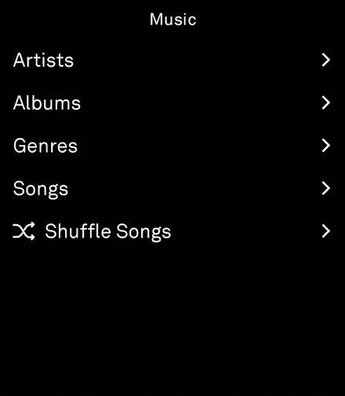

<p align="center">
  
</p>

<sub>The music tool running on a Light Phone III — browsing the on-device
library and playing back over the SDK's audio APIs.</sub>

# music-app

A standalone [Light Phone III](https://www.thelightphone.com/) tool: an
iPod-style music player that browses the device's on-device library over
`MediaStore` and plays it back. It is a thin, self-contained repo built against
the upstream **Light SDK**, and it is laid out to drop straight into Light's
tool build / review pipeline.

## Layout

```
music-app/
├── light-sdk/            # git submodule → upstream Light SDK (pinned commit)
├── tool/                 # the ONLY dev-owned module
│   ├── lighttool.toml    # tool id, label, version, declared permissions
│   ├── build.gradle.kts  # dependencies (project(":sdk:client") + light.sdk plugin)
│   └── src/main/kotlin/com/thelightphone/sample/**.kt
├── settings.gradle.kts   # grafts the submodule's SDK projects into this build
├── build.gradle.kts      # thin root: plugin classpath + ext build knobs
├── gradle.properties
└── gradlew, gradle/       # wrapper (matches the pinned SDK)
```

### Why a submodule?

Neither `:sdk:client` (the tool-facing SDK library) nor the
`com.thelightphone.light-sdk` Gradle plugin are published as artifacts — only
`sdk:ui` / `sdk:server` / `sdk:shared` and the keyboard go to GitHub Packages.
So the SDK must be consumed **as source**. This repo pins the upstream SDK as
the `light-sdk/` submodule and, in `settings.gradle.kts`, includes its
`:sdk:client` / `:sdk:ui` / `:sdk:shared` / `:lint-rules` projects as real
projects and its `plugin` as an included build. It also reuses the submodule's
own version catalog (`light-sdk/gradle/libs.versions.toml`) so this shell never
drifts from what the pinned SDK expects.

## Building locally

Requires JDK 17 and an Android SDK. Provide a GitHub token with `read:packages`
so the transitive keyboard dependency resolves — either in `local.properties`:

```properties
sdk.dir=/path/to/android-sdk
gpr.user=<your-github-user>
gpr.key=<token with read:packages>
```

or as env vars `GH_PACKAGES_USER` / `GH_PACKAGES_TOKEN`. Then:

```bash
./gradlew :tool:assembleDebug
# → tool/build/outputs/apk/debug/tool-debug.apk
```

The APK is signed with the shared Light dev keystore (from the submodule) for
local sideloading. Light's build service re-signs with its own key.

## Running in the LightOS emulator (development)

To exercise the tool end-to-end on a desktop Android emulator you also need the
SDK's **LightOS emulator** app, which hosts the tool the way `com.lightos` does
on real hardware. Its source already lives in the `light-sdk/` submodule
(`light-sdk/sdk/emulator`) — it is **not** a separate submodule — so it is
grafted into this build on demand behind the `withEmulator` flag. It stays off
by default so the release workflow and Light's tool-only review pipeline never
build it.

```bash
# One-off (bare flag is enough):
./gradlew -PwithEmulator :sdk:emulator:assembleDebug :tool:assembleDebug

# Or persist it for your checkout by adding to local.properties:
#   withEmulator=true
```

To actually run it:

1. Create an AVD that approximates an LP3 (see the SDK's own README) and, for
   push/permission features, run the emulator as a **system app** — that needs
   `light-sdk/sdk/emulator/keys/platform.jks` (see the SDK repo for how to
   generate it). Without the keystore the emulator still builds; it just can't
   run as uid 1000.
2. Install both APKs (`:sdk:emulator` and `:tool`) on the emulator.
3. Point the tool at the emulator instead of hardware by setting
   `serverPackage = "com.thelightphone.sdk.emulator"` in `tool/lighttool.toml`
   for your local build (the committed value is `com.lightos` for release —
   don't commit the emulator value).

## Bumping the SDK

```bash
git -C light-sdk fetch origin
git -C light-sdk checkout <commit-or-tag>
git add light-sdk && git commit -m "bump light-sdk to <ref>"
```

> The tool currently pins `tthayer/light-sdk@music-tool`, which carries the
> `LightAudioLibrary` / `LightVolumeOverlay` Kotlin APIs (and the `LightActivity`
> audio hooks) that the player depends on. Upstream `lightphone/light-sdk` has
> the `READ_MEDIA_AUDIO` **permission plumbing** but not yet the audio-playback
> API itself, so the submodule can't move to upstream `main` until that API
> lands there too.

## Releases (CI)

`.github/workflows/release.yml` cuts a GitHub Release on every merge to `main`:

1. Derives the next version from conventional-commit messages since the last
   tag — `feat:` → minor, `fix:` → patch, `feat!:` / `BREAKING CHANGE` → major
   — seeded at **v0.1.0** for the first release.
2. Syncs `tool/lighttool.toml` (`versionName` = the tag, `versionCode` = release
   count) and commits it back to `main` with `[skip ci]`.
3. Builds a signed release APK (`:tool:assembleRelease`, dev keystore) and
   attaches it to a GitHub Release tagged `vX.Y.Z` with auto-generated notes.

The APK is signed with the shared Light **dev** key — fine for sideloading, but
distinct from a Light-service-signed build. Package reads use the built-in
`GITHUB_TOKEN`; add a `GH_PACKAGES_TOKEN` repo secret if cross-org package
access ever needs a PAT.

## Light's build & review pipeline

Light's containerized builder clones this repo and extracts **only**
`tool/build.gradle.kts`, `tool/lighttool.toml`, and `tool/src/main/**`, then
compiles them against its own pinned, sandboxed copy of the SDK (the submodule
and gradle shell here are ignored by the builder — they exist for local
builds). It generates `AndroidManifest.xml` from `lighttool.toml`, so this repo
intentionally contains no hand-written manifest and never sets `applicationId`,
`versionCode`, `versionName`, or `namespace`.
